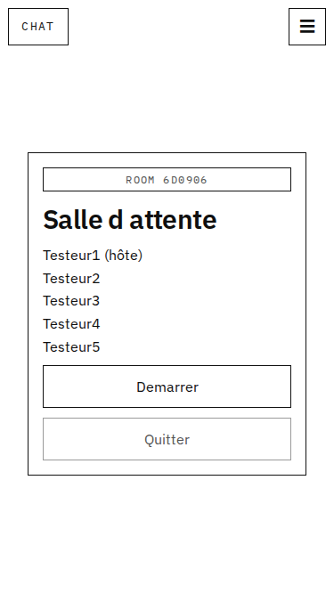
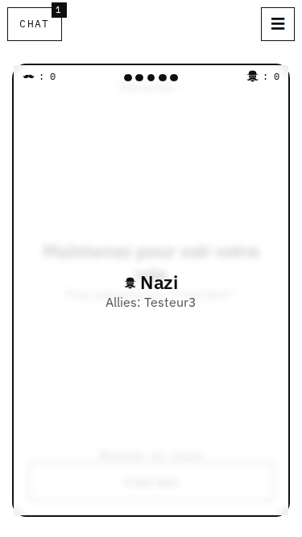
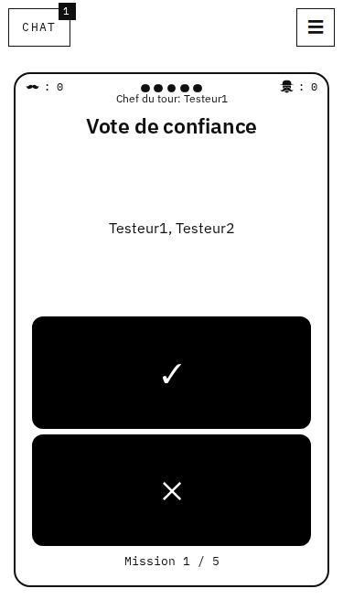
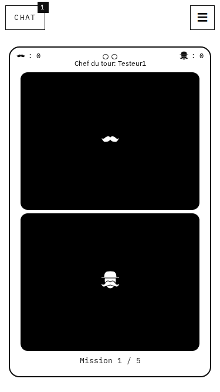
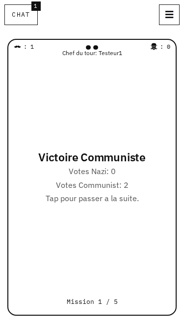

<div align="center">

# Nazi Communiste

**Jeu de déduction sociale en temps réel : une minorité de nazis infiltrés contre une majorité de communistes.**
Chacun joue sur son téléphone, autour d'une table ou à distance.

[**Jouer →**](https://fascismwontget.me) · [Règles](docs/REGLES.md) · [Audit technique](docs/audit.md)

[](https://github.com/noenttrs/Komintern/actions/workflows/ci.yml)

</div>

<p align="center">
  
  
  
  
  
</p>

## Le jeu

3 à 14 joueurs (le format de référence est à 5 : 2 nazis, 3 communistes), et un **duel** à 2. Les nazis connaissent tous les rôles ; les communistes ne connaissent que le leur. Chaque manche :

1. **Proposition** : le chef choisit une équipe.
2. **Vote de confiance** : tout le monde vote publiquement. Il faut une majorité stricte, sinon le même chef repropose.
3. **Mission** : l'équipe vote en secret. Un seul vote nazi fait échouer la mission.

Le premier camp à (joueurs ÷ 2) + 1 missions gagne, ou à 3 missions sur 5 en partie rapide (au choix à la création de la room). Règles complètes : [`docs/REGLES.md`](docs/REGLES.md).

## Fonctionnalités

- **Parties en temps réel** de 3 à 14 joueurs via WebSocket, et un **duel à 2** (chacun ne connaît que son rôle, puis vote en secret « confiance » ou « nazi ! »), avec reprise automatique après un rechargement ou une coupure réseau (resynchronisation complète de l'état).
- **Rejoindre en un scan** : lien d'invitation `/r/CODE`, QR code plein écran, et scan du QR code directement dans l'app (sans passer par l'appareil photo ni Safari) ; **rooms publiques** pour jouer avec des inconnus.
- **Sur place ou à distance** : sans chat autour d'une table, avec chat à distance. L'hôte peut exclure un joueur, transférer son rôle ou changer de mode.
- **Jouable sans compte.** Le compte est facultatif : email + mot de passe avec code de validation, ou Google.
- **Profil et statistiques** : victoires, défaites, taux de victoire, détail par camp, succès, historique des parties.
- **Amis** : demandes, présence en ligne ou en partie, invitation dans sa room, classement, profil visible uniquement par les amis.
- **Sécurité du compte** : double authentification TOTP facultative, changement d'email confirmé par code.
- **Prise en main** : règles consultables en pleine partie, astuces de première partie, vibration et son quand c'est son tour.
- **Notifications Web Push** (même écran verrouillé, iPhone compris en web app) : ton tour, et un avertissement 20 s avant d'être compté absent. Quand un joueur se déconnecte, les autres peuvent choisir de l'attendre ; il est prévenu et retrouve sa place en touchant la notification.
- **Chat de room repliable** pour jouer à distance, **sans censure** : les termes signalés (haine, menaces, harcèlement, coordonnées personnelles) et les signalements ouvrent un dossier pseudonymisé, vérifié à la main par l'équipe, avec levée d'anonymat tracée.
- **Panel de modération** séparé, protégé par une double authentification : les modérateurs voient les conversations signalées **anonymisées** et choisissent une conséquence (avertissement, mute, ban du chat, demande de ban définitif) que **le serveur applique** sans leur révéler l'identité. L'**administration** (statistiques, audience, contact, comptes) tranche les demandes de ban définitif, lève les sanctions et nomme les modérateurs ; chaque action est tracée.
- **Mesure d'audience anonyme**, sans cookie ni service tiers (empreinte hachée avec un sel quotidien jamais conservé).
- **Web app installable** (PWA) et **responsive**, du 320 px au grand écran, dans une direction artistique monochrome.
- **Pages pour les agents IA** : [`llms.txt`](https://fascismwontget.me/llms.txt) et [`agents.html`](https://fascismwontget.me/agents.html).

## Architecture

```
navigateur ──HTTPS──▶ Cloudflare ──tunnel──▶ nginx (client React / PWA)
                                              ├─ /socket.io ─▶ Node.js · Socket.IO ─▶ moteur de règles Python (1 process par partie)
                                              └─ /api ───────▶ Node.js · Express
                                                                 ├─ MongoDB : comptes, amis, stats · logs de parties (utilisateurs cloisonnés)
                                                                 └─ Redis   : sessions, codes, présence, limites de débit
```

| Couche | Technologies |
|---|---|
| Client | React 18, TypeScript strict, Vite, Socket.IO client, vite-plugin-pwa |
| Serveur | Node.js 24, TypeScript, Socket.IO, Express 5, argon2, jose (OIDC Google) |
| Moteur de jeu | Python 3.12, bibliothèque standard uniquement, protocole NDJSON avec identifiants de requête |
| Données | MongoDB 7 (deux utilisateurs séparés pour le jeu et les logs), Redis 7 |
| Infra | Docker Compose, nginx, tunnel Cloudflare, redémarrage automatique |

Quelques choix notables :

- **Le moteur Python est la seule source de vérité des règles.** Le serveur orchestre, filtre ce que chaque joueur a le droit de voir et relaie. Chaque réponse du moteur est validée, avec un timeout et une reprise en cas de crash.
- **Toutes les actions d'une même partie passent par une file sérialisée**, ce qui supprime les courses entre deux clics ou deux joueurs.
- **Un siège ne se reprend qu'avec un secret propre à l'onglet**, jamais diffusé. Les identifiants de joueurs, eux, sont publics.
- **Sécurité** :
  - sessions opaques en cookie `HttpOnly; Secure; SameSite=Lax` et contrôle de l'`Origin` contre le CSRF ;
  - Google en PKCE ;
  - l'utilisateur Mongo du jeu n'a aucun accès aux logs, et celui des logs ne peut rien y supprimer ;
  - aucun port de base de données exposé.
- **Vie privée** : les logs de parties sont anonymisés au bout de 12 mois, et la suppression du compte est en libre-service.

## Lancer le projet

```bash
git clone https://github.com/noenttrs/Komintern.git && cd Komintern
cp .env.example .env    # renseigner les mots de passe (openssl rand -hex 24) et PUBLIC_URL
docker compose up -d --build
# → http://localhost:8080
```

Sans clé Resend, les codes de validation s'affichent dans `docker compose logs server`. Sans identifiants Google, le bouton Google est masqué.

## Tests

```bash
scripts/check.sh        # lint, types, tests moteur, serveur et client, build Docker, intégration des bases
```

- **Moteur** : tests des règles, des 12 formats classiques (3 à 14 joueurs), des 9 formats rapides, de la table des résultats du duel, de la validation et du protocole.
- **Serveur** : tests unitaires et de bout en bout, dont des parties complètes avec le vrai moteur, les comptes, la double authentification, les amis, le chat modéré, les rooms publiques et l'administration.
- **Client** : tests du reducer, des hooks et des écrans.
- **Tests visuels Playwright** : parties à 5 joueurs dans 5 navigateurs mobiles (sur place et à distance, liens d'invitation), et contrôle de la mise en page de 320 à 1440 px.
- **CI GitHub Actions** sur chaque push.
- **Images Docker** : elles ne se construisent que si les tests passent.

## Structure

```
client/        interface React (écrans de jeu, menu, pages, PWA) et tests Playwright
server/        Socket.IO, API, comptes, amis, modération, admin, CLI
gameengine/    moteur de règles Python et tests
infra/         initialisation MongoDB
scripts/       vérification, intégration, sauvegarde
docs/          règles, audit technique, briefs de conception
```

## Licence

- **Code** : [AGPL-3.0](LICENSE). Le code est libre ; toute version modifiée mise en ligne doit publier son code source sous la même licence.
- **Règles du jeu** ([`docs/REGLES.md`](docs/REGLES.md)) : © Komintern, [CC BY-NC-SA 4.0](https://creativecommons.org/licenses/by-nc-sa/4.0/deed.fr). Partage et adaptation autorisés en citant l'auteur, sans usage commercial, et sous la même licence.
